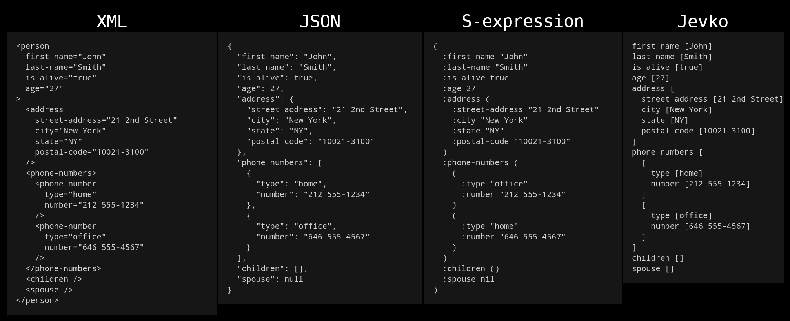

# Jevko: minimal syntax

[**Jevko**](https://jevko.org) is a minimal syntax for encoding tree-structured data. For example:

```
first name [John]
last name [Smith]
is alive [true]
age [27]
address [
  street address [21 2nd Street]
  city [New York]
  state [NY]
  postal code [10021-3100]
]
phone numbers [
  [
    type [home]
    number [212 555-1234]
  ]
  [
    type [office]
    number [646 555-4567]
  ]
]
children []
spouse []
```

## Comparison

Below is an illustration of how Jevko compares to other syntaxes in terms of compactness, simplicity, and human-readability.



## Formal grammar

The simplest grammar able to match Jevko can fit in one line of [ABNF](https://en.wikipedia.org/wiki/Augmented_Backus-Naur_form):

```abnf
Jevko = *("[" Jevko "]" / "`" ("`" / "[" / "]") / %x0-5a / %x5c / %x5e-5f / %x61-10ffff)
```

This is enough to build a Jevko validator or a low-level parser.

To implement a higher-level parser which constructs useful parse trees, the reference canonical Jevko grammar is given below:

```abnf
; basic structures
Jevko = Subjevkos Suffix
Subjevko = Prefix "[" Jevko "]"

; aliases
Subjevkos = *Subjevko
Suffix = Text
Prefix = Text

; text
Text = *(Digraph / Character)
Digraph = "`" ("`" / "[" / "]")
; Char is any Unicode character except the three special characters: "`" / "[" / "]"
Character = %x0-5a / %x5c / %x5e-5f / %x61-10ffff
```

It matches the same strings as the low-level grammar, except that it produces useful parse trees.

## Attribution

The example of Jevko data shown here is based on an example piece of JSON from [Wikipedia](https://en.wikipedia.org/wiki/JSON#Syntax).

***

© 2022 [Jevko.org](https://jevko.org)