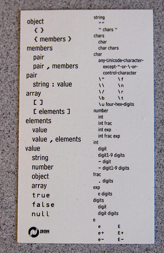

<h1>Jevko: minimal syntax</h1>

[**Jevko**](https://jevko.org) is a minimal syntax for encoding tree-structured information. 

Its foundation is a beautifully simple abstract grammar, expressed in ABNF[<sup>[W]</sup>](https://en.wikipedia.org/wiki/Augmented_Backus-Naur_form) as follows:

```cs
Jevko = *(open Jevko close / data)
```

Defining `open`, `close`, and `data` on top of a particular set of symbols instantiates a Jevko variant.

The standard variant is defined on top of Unicode[<sup>[W]</sup>](https://en.wikipedia.org/wiki/Unicode):

```cs
Jevko   = *(open Jevko close / data)
open    = "["
close   = "]"
data    = 1*(escape / char)
escape  = "`" ("[" / "]" / "`")
```

where `char` is any Unicode character/code point[<sup>[W]</sup>](https://en.wikipedia.org/wiki/Code_point) excluding the 3 special symbols: 
  1. `[` -- left square bracket, code point 91.
  2. `]` -- right square bracket, code point 93.
  3. `` ` `` -- grave accent, code point 96.

Refinements are then layered over Jevko trees to model domain-specific languages[<sup>[W]</sup>](https://en.wikipedia.org/wiki/Domain-specific_language).

## Data Jevko

**Data Jevko** is Jevko refined into a generic data language -- a simple alternative to JSON or XML:

```
first name [John]
last name [Smith]
is alive [true]
age [27]
address [
  street address [21 2nd Street]
  city [New York]
  state [NY]
  postal code [10021-3100]
]
phone numbers [
  [
    type [home]
    number [212 555-1234]
  ]
  [
    type [office]
    number [646 555-4567]
  ]
]
children []
spouse []
```

Comparable JSON:

```
{ 
  "first name": "John",
  "last name": "Smith",
  "is alive": true,
  "age": 27,
  "address": {
    "street address": "21 2nd Street",
    "city": "New York",
    "state": "NY",
    "postal code": "10021-3100"
  },
  "phone numbers": [
    {
      "type": "home",
      "number": "212 555-1234"
    },
    {
      "type": "office",
      "number": "646 555-4567"
    }
  ],
  "children": [],
  "spouse": null 
}
```

And XML:

```
<person 
  first-name="John" 
  last-name="Smith"
  is-alive="true"
  age="27"
>
  <address 
    street-address="21 2nd Street" 
    city="New York" 
    state="NY" 
    postal-code="10021-3100" 
  />
  <phone-numbers>
    <phone-number
      type="home"
      number="212 555-1234"
    />
    <phone-number
      type="office"
      number="646 555-4567"
    />
  </phone-numbers>
  <children />
  <spouse xsi:nil="true" />
</person>
```

In Data Jevko, trees are restricted to 3 basic types:

* **Primitives** which contain no nested trees, e.g. `21 2nd Street`.
* **Lists** which contain one or more nested trees optionally surrounded by blanks, e.g. `[1] [2] [3]`.
* **Keyed lists** which are like lists, except each nested tree must be preceded by its **key** -- a sequence of characters that begins and ends with a nonblank. E.g. `name [John] age [27]`.

Any other shape is invalid Data Jevko.

## Etymology

The name *Jevko* is derived from Polish *drzewko*, meaning *small tree*.

## Business Card

Below is the Jevko Business Card which contains the complete definition of the syntax:


The idea is based on Douglas Crockford's business card for JSON:



## Attribution

The example piece of JSON is from [Wikipedia](https://en.wikipedia.org/wiki/JSON#Syntax).

JSON Business Card is from [Parsing JSON is a Minefield 💣 by Nicolas Seriot](http://seriot.ch/parsing_json.php#1).

***

Jevko is a part of [TAO](https://xtao.org), a project to cultivate simplicity in software.

© 2021 Jevko.org