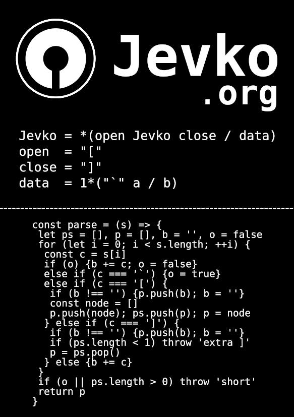

<h1>Jevko: a universal syntax</h1>

[**Jevko**](https://jevko.org)^[The name *Jevko* is derived from Polish *drzewko*, meaning *small tree*.] is a minimal universal syntax for encoding tree-structured information. 

Its foundation is a beautifully simple abstract grammar, expressed in ABNF[<sup>[W]</sup>](https://en.wikipedia.org/wiki/Augmented_Backus-Naur_form) as follows:

```cs
Jevko = *(open Jevko close / data)
```

Defining `open`, `close`, and `data` on top of a particular set of symbols instantiates a Jevko variant.

The standard variant is defined on top of Unicode[<sup>[W]</sup>](https://en.wikipedia.org/wiki/Unicode):

```cs
Jevko   = *(open Jevko close / data)
open    = "["
close   = "]"
data    = 1*("`" a / b)
```

where:

* `a` is any Unicode character corresponding to a code point[<sup>[W]</sup>](https://en.wikipedia.org/wiki/Code_point).
* `b` is `a` excluding the 3 special symbols: 
  1. <span class="metasym">`[`</span> -- left square bracket, code point 91.
  2. <span class="metasym">`]`</span> -- right square bracket, code point 93.
  3. <span class="metasym">`` ` ``</span> -- grave accent, code point 96.

Refinements are then layered over Jevko trees to model domain-specific languages[<sup>[W]</sup>](https://en.wikipedia.org/wiki/Domain-specific_language).

For example, **Data Jevko** is a generic data language that provides a simple alternative to JSON or XML^[Example piece of data from [Wikipedia](https://en.wikipedia.org/wiki/JSON#Syntax)]:

<a name="data"></a>

INCLUDE src/parts/data.part.md

In Data Jevko, trees are restricted to 3 basic types:

* **Primitives** which contain no nested trees, e.g. <span class="metasym">`21 2nd Street`</span>.
* **Lists** which contain one or more nested trees optionally surrounded by blanks, e.g. <span class="metasym">`[1] [2] [3]`</span>.
* **Keyed lists** which are like lists, except each nested tree must be preceded by its **key** -- a sequence of characters that begins and ends with a nonblank. E.g. <span class="metasym">`name [John] age [27]`</span>.

Any other shape is invalid Data Jevko.



***

Jevko is a part of [TAO](https://xtao.org), a project to simplify and interconnect software.