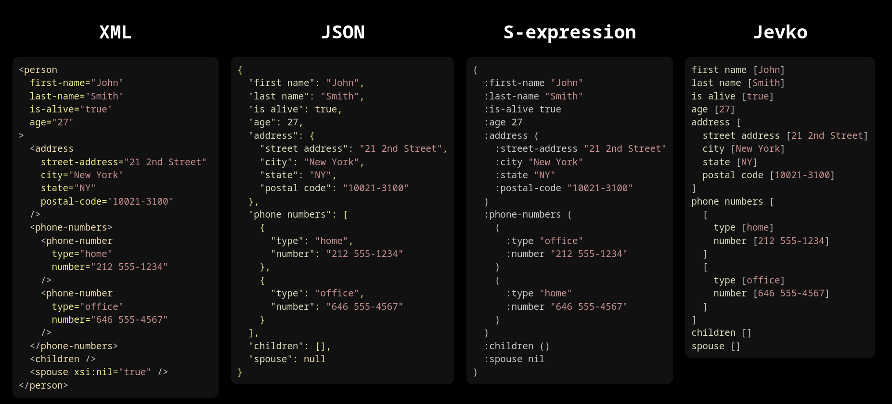
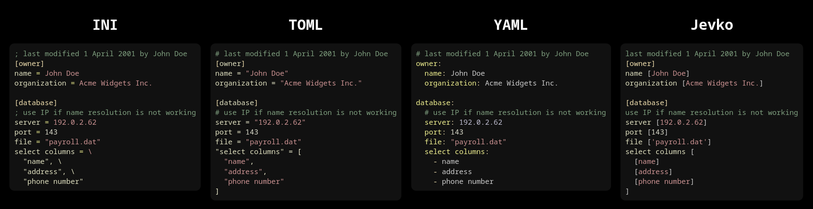

# Jevko: minimal syntax 

[jevko.github.io](https://jevko.github.io) | [jevko.org](https://jevko.org)

**Jevko** is a minimal general-purpose syntax.

It can be used as a basic building block for simple and portable formats, languages, and notations in a variety of domains, such as data interchange, configuration, or text markup.

Below are a few illustrative examples of how Jevko formats compare to known formats in various domains.

 <!-- in terms of compactness, simplicity, and human-readability. -->

## Data interchange

## Configuration

## Markup

## Formal grammar

The Standard Jevko Grammar is [specified here](https://github.com/jevko/specifications/blob/master/spec-standard-grammar.md).

## See also

See the following pages for more information:

[jevko.github.io](https://jevko.github.io)

[jevko.org](https://jevko.org)

---

[resources.md](resources.md)

[parsers.md](parsers.md)

[formats.md](formats.md)

[variants-and-extensions.md](variants-and-extensions.md)

[tools.md](tools.md)

[various.md](various.md)

## Attribution

The example of Jevko data shown here is based on an example piece of JSON from [Wikipedia](https://en.wikipedia.org/wiki/JSON#Syntax).

***

© 2022 [Jevko.org](https://jevko.org)
