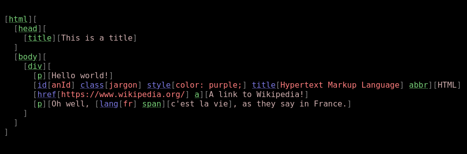

# Data interchange

https://github.com/jevko/jevkodata1.js

## Interjevko

https://github.com/jevko/interjevko.js

### Schema

https://github.com/jevko/jevkoschema.js

## Easy Jevko

### Lua

https://github.com/jevko/easyjevko.lua

### JavaScript

https://github.com/jevko/easyjevko.js

# Markup

https://github.com/jevko/jevkomarkup2.js

https://github.com/jevko/jevkomarkup1.js

https://github.com/jevko/jevkodom.js

https://github.com/jevko/markup-experiments -- experiments

# Configuration

https://github.com/jevko/jevkoconfig1.js

https://github.com/jevko/jevkonfig.js

# Diagramming

https://github.com/jevko/jevkotodot.js

# Code

https://github.com/jevko/jevkalk

# Query strings

https://github.com/jevko/queryjevko.js